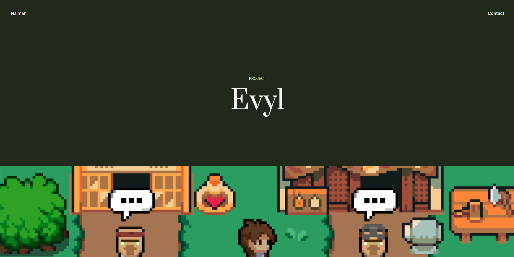

# React Porfolio

React web application for my portfolio


### Built With

* [![React][React.js]][React-url]
* [![TS][Typescript]][Typescript-url]
* [![Tailwind][TailwindCSS]][Tailwindcss-url]

# Live Demo

A live demo is availaible [here](https://www.naiman.fr/)

## Getting Started

### Installation
1. Clone the repo
```sh
git clone https://github.com/NaimanMpl/react-portfolio-v2.git
```
2. Install npm packages
```sh
npm install
```
3. Launch server and client
```sh
npm run dev
```

## License
Distributed under the MIT License. See `LICENSE.txt` for more information.

[Typescript]: https://img.shields.io/badge/TypeScript-007ACC?style=for-the-badge&logo=typescript&logoColor=white
[Typescript-url]: https://www.typescriptlang.org/
[Node.js]: https://img.shields.io/badge/Node.js-43853D?style=for-the-badge&logo=node.js&logoColor=white
[Nodejs-url]: https://nodejs.org/en
[React.js]: https://img.shields.io/badge/React-20232A?style=for-the-badge&logo=react&logoColor=61DAFB
[React-url]: https://reactjs.org/
[SASS]: https://img.shields.io/badge/Sass-CC6699?style=for-the-badge&logo=sass&logoColor=white
[Sass-url]: https://sass-lang.com/
[Tailwindcss-url]: https://tailwindcss.com/
[TailwindCSS]: https://img.shields.io/badge/Tailwind_CSS-38B2AC?style=for-the-badge&logo=tailwind-css&logoColor=white